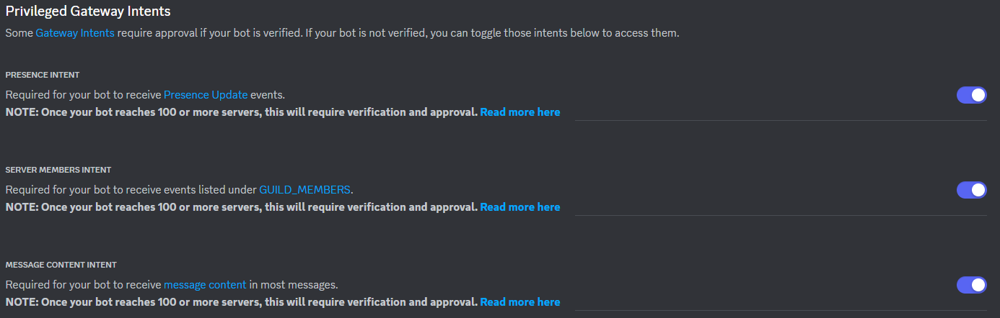
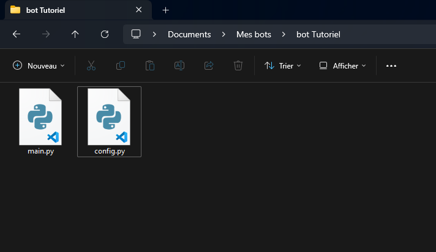
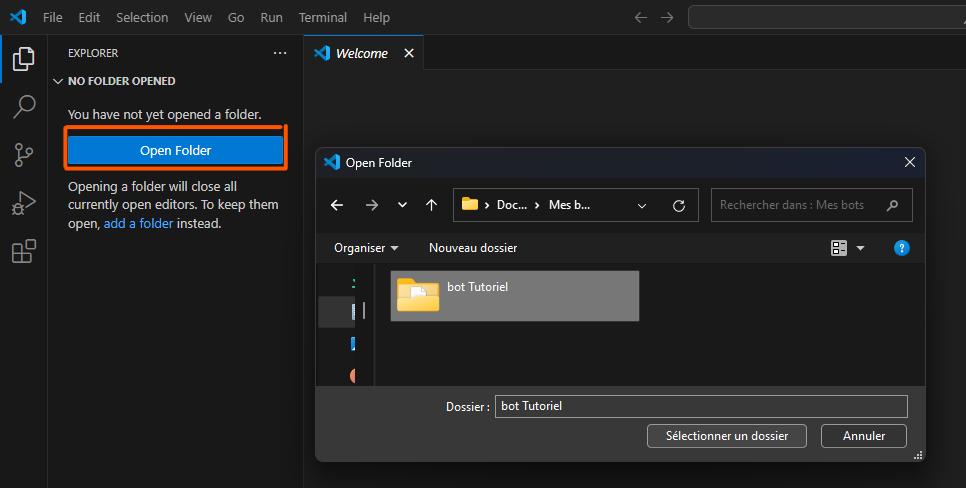
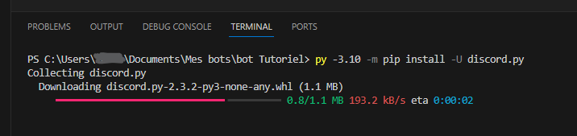
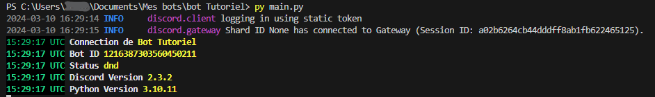

import Tabs from '@theme/Tabs'; 
import TabItem from '@theme/TabItem'; 

# Première utilisation

Cette partie est également disponible en vidéo.

## Prérequis Matériel

- Un PC avec l'un des systèmes d'exploitation suivants :
  - Windows 10/11
  - Linux
  - MacOS
- Une connexion internet

## Prérequis Logiciel

- Python : 3.10 (Installation disponible )
- Visual Studio Code (Installation disponible )
- Discord PC installé

## Création du bot

Pour créer un bot, rendez-vous sur [le portail des développeurs Discord](https://discord.com/developers/applications).

1. Cliquez sur "Nouvelle application".
2. Donnez-lui un nom.
3. Allez dans la section "Bot" et cochez **toutes** les ***Intents*** :



## Choix du langage

Nous avons choisi Python !

:::info
Il est possible de développer en JavaScript, Java, C#, Ruby, Go, PHP, Swift. Nous n'aborderons pas ces langages dans cette documentation.
:::

## Création de notre environnement de développement

Créez un dossier que nous nommerons "bot Tutoriel".

Créez les fichiers :
- main.py
- config.py

Hiérarchie :

```text
bot Tutoriel
  ├── main.py
  ├── config.py
```

Voici le résultat :



Ouvrez ce dossier dans l'éditeur Visual Studio Code :



## Installation des bibliothèques

### Discord.Py

<Tabs>
  <TabItem value="windows" label="Windows 10/11" default>
    ```bash
    # Ouvrez une invite de commandes (Command Prompt) en tant qu'administrateur et exécutez la commande suivante :
    py -m pip install -U discord.py
    ```
  </TabItem>
  <TabItem value="linux" label="Linux">
    ```bash
    # Ouvrez le terminal et exécutez la commande suivante :
    python3 -m pip install -U discord.py
    ```
  </TabItem>
  <TabItem value="apple" label="Apple">
    ```bash
    # Ouvrez le terminal et exécutez la commande suivante :
    python3 -m pip install -U discord.py
    ```
  </TabItem>
</Tabs>

### Colorama

<Tabs>
  <TabItem value="windows" label="Windows 10/11" default>
    ```bash
    # Ouvrez une invite de commandes (Command Prompt) en tant qu'administrateur et exécutez la commande suivante :
    py -m pip install colorama
    ```
  </TabItem>
  <TabItem value="linux" label="Linux">
    ```bash
    # Ouvrez le terminal et exécutez la commande suivante :
    python3 -m pip install colorama
    ```
  </TabItem>
  <TabItem value="apple" label="Apple">
    ```bash
    # Ouvrez le terminal et exécutez la commande suivante :
    python3 -m pip install colorama
    ```
  </TabItem>
</Tabs>

Exemple visuel :



## Configuration du bot

Ouvrez le fichier config.py.

Pour éviter de changer les informations partout, un fichier comme celui-ci doit tout posséder.

Insérez le code suivant :

### config.py

```python
class Config:
    token = "VOTRE_TOKEN" # Token accessible dans le panneau de votre application dans Bot, puis "Reset Token".
    version = "0.0.1" # Version que vous pouvez donner à votre bot
    prefix = "!" # Préfixe pour les commandes
    main_color = 0x3498db  # Bleu
    success_color = 0x2ecc71  # Vert
    danger_color = 0xe74c3c  # Rouge
    warning_color = 0xf39c12 # Jaune orangé
    info_color = 0x3498db  # Bleu (ou une autre couleur pour l'information)
    status = "dnd"  # (online, idle, dnd, invisible)
```

### main.py

```python
import discord
import time
import platform
from discord.ext import commands
from config import *
from colorama import Back, Fore, Style

bot = commands.Bot(command_prefix='!', intents=discord.Intents.all())

@bot.event
async def on_ready():
    await bot.change_presence(status=discord.Status[Config.status])
    prfx = (
        Back.BLACK + Fore.GREEN + time.strftime("%H:%M:%S UTC", time.gmtime())
        + Back.RESET + Fore.WHITE + Style.BRIGHT
    )
    print(prfx + " Connection de " + Fore.YELLOW + bot.user.name)
    print(prfx + " Bot ID " + Fore.YELLOW + str(bot.user.id))
    print(prfx + " Status " + Fore.YELLOW + str(Config.status))
    print(prfx + " Discord Version " + Fore.YELLOW + discord.__version__)
    print(prfx + " Python Version " + Fore.YELLOW + str(platform.python_version()))

# Lancer le bot
bot.run(Config.token)
```

## Lancer le bot

Pour lancer votre bot, utilisez la commande suivante dans le dossier où se trouvent les fichiers :

<Tabs>
  <TabItem value="windows" label="Windows 10/11" default>
    ```bash
    # Ouvrez une invite de commandes (Command Prompt) en tant qu'administrateur et exécutez la commande suivante :
    py main.py
    ```
  </TabItem>
  <TabItem value="linux" label="Linux">
    ```bash
    # Ouvrez le terminal et exécutez la commande suivante :
    python3 main.py
    ```
  </TabItem>
  <TabItem value="apple" label="Apple">
    ```bash
    # Ouvrez le terminal et exécutez la commande suivante :
    python3 main.py
    ```
  </TabItem>
</Tabs>

Si cela fonctionne, vous devriez voir quelque chose de similaire à ceci (avec vos informations bien évidemment) :



## Aller plus loin

Le bot est lancé, mais il n'y a pas encore de commandes.


:::ameliorations

Pas de panique ! La suite de la documentation est prévu, resté à l'affut 

:::