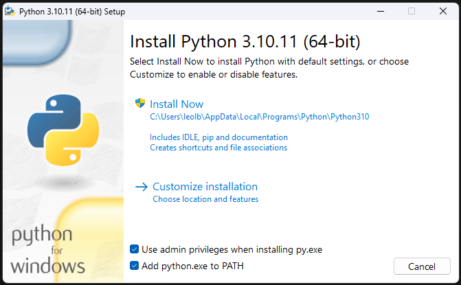
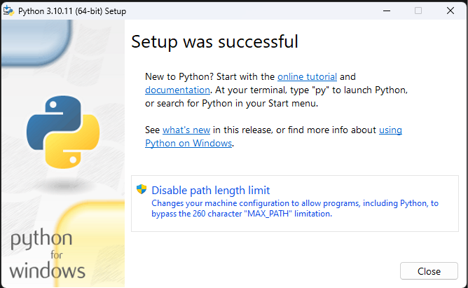
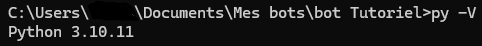

import Tabs from '@theme/Tabs'; 
import TabItem from '@theme/TabItem'; 

# Python

## Prérequis Logiciel

* Python : 3.10 (L'installation est disponible [ici](lien_vers_python)). Si vous n'avez pas Python installé, veuillez suivre ces étapes :
  

### Installation de Python

:::tip
Si vous ne faites pas confiance au lien, vous trouverez toutes les versions [ici](https://www.python.org/downloads/release/python-31011/) (dans la section "Files").
:::

<Tabs>
  <TabItem value="windows" label="Windows 10/11" default>

    **Windows :**

  
  + Téléchargez la dernière version de Python depuis [le site officiel](https://www.python.org/downloads/).
  + Lancez l'installateur et assurez-vous de cocher la case "Ajouter Python 3.x au PATH" pendant l'installation.

  
  
  </TabItem>
  <TabItem value="linux" label="Linux">
  **Linux :**
  
  + Ouvrez le terminal et exécutez les commandes suivantes :

    

  ```bash
    sudo apt update
    sudo apt install python3.10
    ```

  </TabItem>
  <TabItem value="mac" label="MacOS">

    **MacOS :**

    - Téléchargez la dernière version de Python depuis [le site officiel](https://www.python.org/downloads/).
    - Lancez l'installateur et assurez-vous de cocher la case "Ajouter Python 3.x au PATH" pendant l'installation.
  </TabItem>
</Tabs>


## Tester l'installation

<Tabs>
  <TabItem value="windows" label="Windows 10/11" default>
  ```bash
    >>> py -V
    3.10
  ```
  </TabItem>
  <TabItem value="linux" label="Linux">
  ```bash
    >>> python3 -V
    3.10
  ```
  </TabItem>
  <TabItem value="mac" label="MacOS">
  ```bash
    >>> python3 -V
    3.10
  ```
  </TabItem>
</Tabs>

Resultat visuel :  

